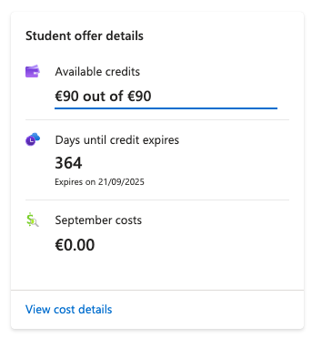

# Infrastructure-as-code discovery

## Setup

### Azure for Students

> [!note]
> Let's enable your Azure for Students offer!

> [!warning]
> You can skip this if you already have enabled it.
> However, make sure you still have most of your $100 (90€) credits.
> If you don't, let @fhuitelec know.

- Go to [Azure for students](https://azure.microsoft.com/fr-fr/free/students)
- Click on "Commencez gratuitement"
- Log in with your JUNIA microsoft account
- You should land on the Azure portal on portal.azure.com
- You should see your student offer like below with $100 (90€) credits.

### GitHub

> [!note]
> Let's create your GitHub account if you don't have one yet!

> [!warning]
> You can skip this if you already have a GitHub account.
> However, make sure you have most of your free 120 included core hours in the [billing area](https://github.com/settings/billing/summary) (search for "Codespaces")
> If you don't, let @fhuitelec know.

- Go to https://github.com/signup
- Follow the guide

## GitHub codespace

> [!note]
> Let's create a codespace for this practical session!

- Go to [fhuitelec/junia-isen-cloud-computing](https://github.com/fhuitelec/junia-isen-cloud-computing)
- Within GitHub interface, click on the **<> Code** button
- Within the popup that opened, go to the **Codespaces** tab
- Click on **Create codespace on week-1-start**
- Follow the guide
